# 8-Puzzle Solver

## Giới thiệu

Đây là bài tập môn AI của mình ứng dụng Python có giao diện đồ họa giúp giải bài toán **8-puzzle** bằng nhiều thuật toán AI khác nhau. Nhầm so sánh và đánh giá hiệu quả của thuật toán đưa ra Ưu / Nhược điểm của chúng.

## Tính năng

- Nhập trạng thái đầu vào cho 8-puzzle.
- Lựa chọn và chạy nhiều thuật toán giải như: BFS, DFS, UCS, IDS, Greedy BFS, A*, IDA*, Hill Climbing, Simulated Annealing, Genetic Algorithm, Beam Search, Backtracking, Min-Conflicts, Q-Learning, DQN, SARSA.
- Hiển thị trực quan trạng thái từng bước giải trên giao diện.
- Xem từng bước hoặc tự động phát lại quá trình giải.
- Thống kê số bước và thời gian giải.

## Trạng thái bắt đầu mặc định

## Các thuật toán 

### 1. Tìm kiếm không thông tin (Uninformed Search)
- **BFS (Breadth-First Search)**: Tìm kiếm theo chiều rộng, duyệt các trạng thái theo từng lớp, đảm bảo tìm được lời giải ngắn nhất nếu chi phí các bước bằng nhau.
  
  **Đánh giá:**
  - **Ưu điểm:** Luôn tìm được lời giải tối ưu (ngắn nhất) cho 8-puzzle.
  - **Nhược điểm:** Tốn rất nhiều bộ nhớ khi số trạng thái lớn, dễ bị tràn bộ nhớ với 15-puzzle hoặc trạng thái phức tạp.
  - **Phù hợp:** Rất tốt cho 8-puzzle với độ sâu lời giải vừa phải.
  - **Nhanh nhất:** Không phải, tốc độ trung bình, nhưng đảm bảo tối ưu.

  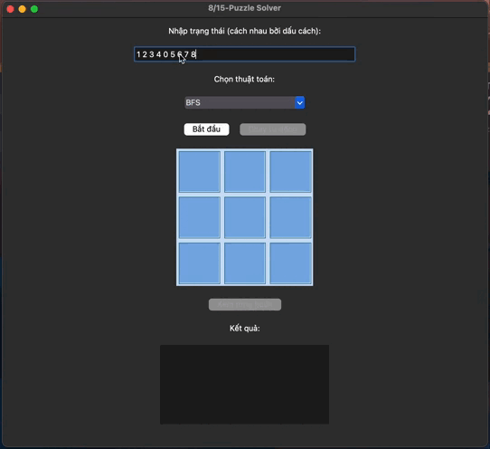

- **DFS (Depth-First Search)**: Tìm kiếm theo chiều sâu, đi sâu vào nhánh hiện tại trước khi quay lại, có thể không tối ưu và dễ gặp lặp vô hạn nếu không kiểm soát.
  
  **Đánh giá:**
  - **Ưu điểm:** Tiết kiệm bộ nhớ hơn BFS, dễ cài đặt.
  - **Nhược điểm:** Không đảm bảo tìm được lời giải ngắn nhất, dễ bị lặp hoặc đi vào nhánh sâu không có lời giải.
  - **Phù hợp:** Không khuyến khích dùng cho 8-puzzle nếu cần lời giải tối ưu.
  - **Nhanh nhất:** Có thể nhanh nếu may mắn, nhưng thường không ổn định.

  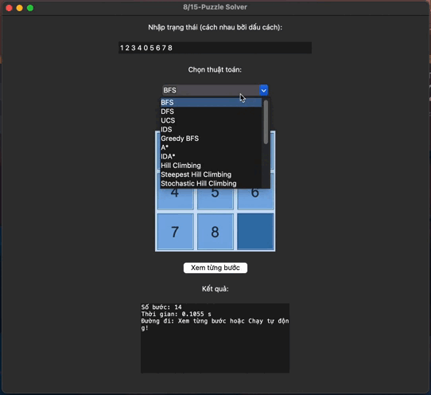

- **UCS (Uniform Cost Search)**: Tìm kiếm theo chi phí đều, luôn mở rộng trạng thái có tổng chi phí nhỏ nhất từ đầu đến hiện tại, đảm bảo tối ưu nếu chi phí dương.
  
  **Đánh giá:**
  - **Ưu điểm:** Đảm bảo tìm được lời giải tối ưu như BFS, nhưng có thể áp dụng cho các bài toán có chi phí bước đi khác nhau.
  - **Nhược điểm:** Tốn bộ nhớ lớn như BFS.
  - **Phù hợp:** Tốt cho 8-puzzle, không khác biệt nhiều so với BFS nếu mọi bước có chi phí như nhau.
  - **Nhanh nhất:** Không.

    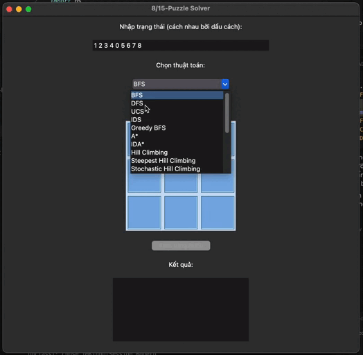

- **IDS (Iterative Deepening Search)**: Kết hợp DFS và BFS, lặp lại DFS với giới hạn độ sâu tăng dần, vừa tiết kiệm bộ nhớ vừa đảm bảo tìm được lời giải ngắn nhất.
  
  **Đánh giá:**
  - **Ưu điểm:** Tiết kiệm bộ nhớ hơn BFS, vẫn đảm bảo tìm được lời giải tối ưu.
  - **Nhược điểm:** Thời gian chạy lâu hơn do phải lặp lại nhiều lần.
  - **Phù hợp:** Tốt cho 8-puzzle khi bộ nhớ hạn chế.
  - **Nhanh nhất:** Không.

  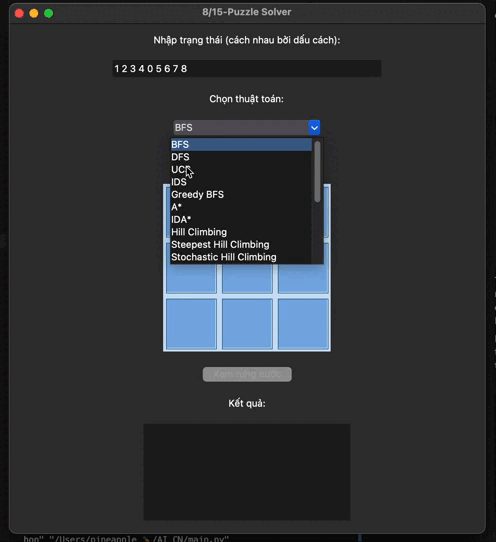

### 2. Tìm kiếm có thông tin (Informed Search)
- **Greedy BFS (Greedy Best-First Search)**: Chọn mở rộng trạng thái có giá trị heuristic nhỏ nhất, thường nhanh nhưng không đảm bảo tối ưu.
  
  **Đánh giá:**
  - **Ưu điểm:** Tốc độ nhanh, tiết kiệm bộ nhớ.
  - **Nhược điểm:** Không đảm bảo tìm được lời giải ngắn nhất, dễ bị kẹt ở trạng thái không tối ưu.
  - **Phù hợp:** Khi cần lời giải nhanh, không quan trọng tối ưu.
  - **Nhanh nhất:** Có thể là một trong những thuật toán nhanh nhất.

  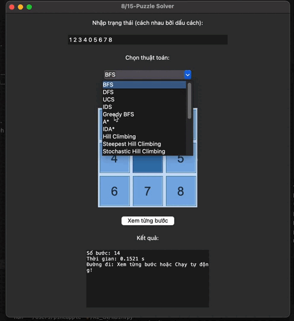

- **A\***: Kết hợp chi phí thực tế và heuristic (f(n) = g(n) + h(n)), đảm bảo tối ưu nếu heuristic chấp nhận được.
  
  **Đánh giá:**
  - **Ưu điểm:** Đảm bảo tìm được lời giải tối ưu, tốc độ nhanh hơn BFS/UCS nhờ heuristic tốt.
  - **Nhược điểm:** Vẫn tốn bộ nhớ lớn nếu không gian trạng thái lớn.
  - **Phù hợp:** Thuật toán mạnh nhất, phù hợp nhất cho 8-puzzle.
  - **Nhanh nhất:** Thường là nhanh nhất và tối ưu nhất nếu heuristic tốt.

  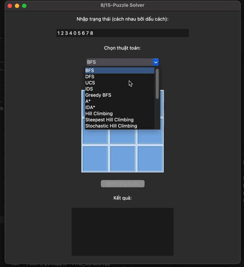

- **IDA\***: Lặp lại A* với ngưỡng chi phí tăng dần, tiết kiệm bộ nhớ hơn A* truyền thống.
  
  **Đánh giá:**
  - **Ưu điểm:** Tiết kiệm bộ nhớ, vẫn đảm bảo tối ưu.
  - **Nhược điểm:** Có thể chạy lâu hơn A* do phải lặp lại nhiều lần.
  - **Phù hợp:** Khi bộ nhớ hạn chế, vẫn muốn lời giải tối ưu.
  - **Nhanh nhất:** Không, nhưng cân bằng giữa bộ nhớ và tối ưu.

  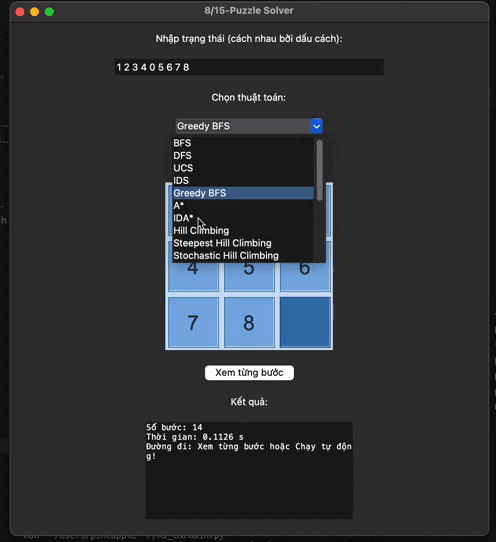

### 3. Tìm kiếm cục bộ (Local Search)
- **Hill Climbing**: Luôn chọn trạng thái lân cận tốt hơn hiện tại, dễ mắc kẹt tại cực trị địa phương.
  
  **Đánh giá:**
  - **Ưu điểm:** Đơn giản, tiết kiệm bộ nhớ.
  - **Nhược điểm:** Dễ bị kẹt ở trạng thái không phải lời giải.
  - **Phù hợp:** Không khuyến khích cho 8-puzzle nếu cần lời giải chắc chắn.
  - **Nhanh nhất:** Có thể rất nhanh, nhưng không ổn định.

  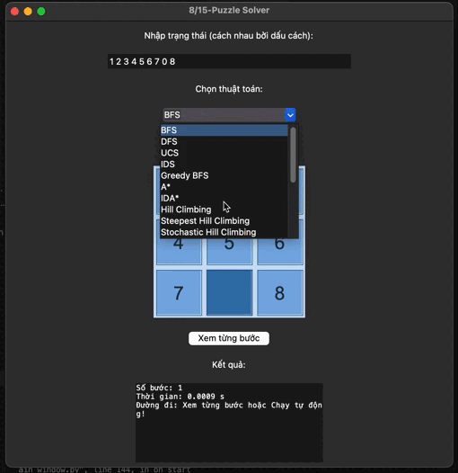

- **Steepest Hill Climbing**: Xem xét tất cả lân cận và chọn tốt nhất, giảm khả năng mắc kẹt hơn so với hill climbing cơ bản.
  
  **Đánh giá:**
  - **Ưu điểm:** Tốt hơn hill climbing cơ bản.
  - **Nhược điểm:** Vẫn có thể kẹt ở cực trị địa phương.
  - **Phù hợp:** Khi cần giải pháp nhanh, không cần tối ưu.
  - **Nhanh nhất:** Có thể.

  

- **Stochastic Hill Climbing**: Chọn ngẫu nhiên một lân cận tốt hơn, giúp tránh lặp lại các trạng thái cũ.
  
  **Đánh giá:**
  - **Ưu điểm:** Giảm khả năng kẹt ở cực trị địa phương.
  - **Nhược điểm:** Không đảm bảo tìm được lời giải.
  - **Phù hợp:** Khi cần đa dạng lời giải, không cần tối ưu.
  - **Nhanh nhất:** Có thể.
  
  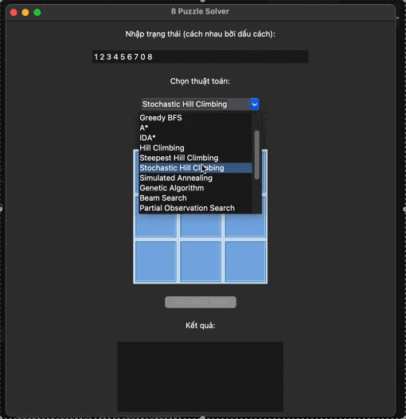

- **Simulated Annealing**: Cho phép chọn trạng thái kém hơn với xác suất giảm dần, giúp thoát khỏi cực trị địa phương.
  
  **Đánh giá:**
  - **Ưu điểm:** Có thể tìm được lời giải tốt hơn hill climbing.
  - **Nhược điểm:** Thời gian chạy không ổn định, không đảm bảo tối ưu.
  - **Phù hợp:** Khi muốn tránh kẹt ở cực trị địa phương.
  - **Nhanh nhất:** Không.

  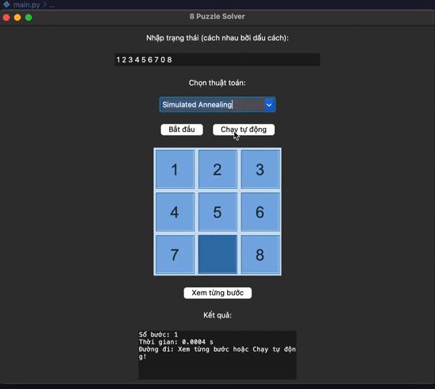

- **Genetic Algorithm**: Mô phỏng tiến hóa tự nhiên, sử dụng quần thể trạng thái, lai ghép và đột biến để tìm lời giải.
  
  **Đánh giá:**
  - **Ưu điểm:** Có thể tìm được lời giải tốt, đa dạng.
  - **Nhược điểm:** Không đảm bảo tối ưu, cần nhiều tham số.
  - **Phù hợp:** Khi muốn thử nghiệm các phương pháp heuristic.
  - **Nhanh nhất:** Không.

  

- **Beam Search**: Chỉ giữ lại một số lượng trạng thái tốt nhất ở mỗi bước, tiết kiệm bộ nhớ hơn so với BFS/A*.
  
  **Đánh giá:**
  - **Ưu điểm:** Tiết kiệm bộ nhớ, tốc độ nhanh.
  - **Nhược điểm:** Không đảm bảo tối ưu.
  - **Phù hợp:** Khi cần giải pháp nhanh, bộ nhớ hạn chế.
  - **Nhanh nhất:** Có thể.

  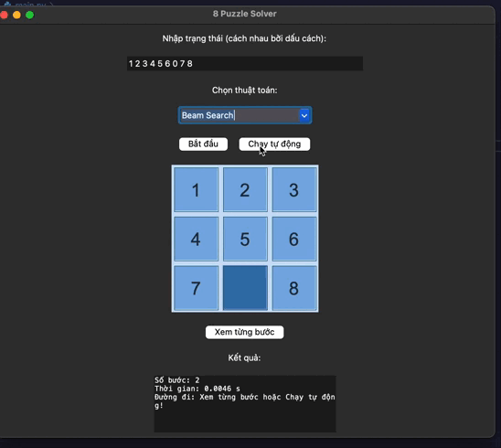

### 4. Môi trường phức tạp (Complex Environments)
- **Partial Observation Search**: Tìm kiếm trong môi trường mà trạng thái không được quan sát đầy đủ, cần suy luận trạng thái thực.
  
  **Đánh giá:**
  - **Ưu điểm:** Mô phỏng các tình huống thực tế hơn.
  - **Nhược điểm:** Phức tạp, khó áp dụng cho 8-puzzle tiêu chuẩn.
  - **Phù hợp:** Khi muốn nghiên cứu các biến thể nâng cao.

  

- **Nondeterministic Search**: Xử lý các hành động có thể dẫn đến nhiều kết quả khác nhau, cần xét tất cả khả năng.
  
  **Đánh giá:**
  - **Ưu điểm:** Mô phỏng môi trường không xác định.
  - **Nhược điểm:** Không phù hợp cho 8-puzzle tiêu chuẩn.
  - **Phù hợp:** Nghiên cứu nâng cao.

  

- **Belief-State Search**: Tìm kiếm trên không gian trạng thái niềm tin (tập hợp các trạng thái có thể), phù hợp cho môi trường không xác định.
  
  **Đánh giá:**
  - **Ưu điểm:** Xử lý tốt môi trường không xác định.
  - **Nhược điểm:** Không cần thiết cho 8-puzzle tiêu chuẩn.
  - **Phù hợp:** Nghiên cứu nâng cao.

  

## 5. Bài toán ràng buộc (CSPs)
- **Backtracking**: Quay lui cơ bản, thử từng giá trị và quay lại khi gặp mâu thuẫn.
  
  **Đánh giá:**
  - **Ưu điểm:** Đơn giản, dễ cài đặt.
  - **Nhược điểm:** Hiệu quả thấp với không gian trạng thái lớn.
  - **Phù hợp:** Không tối ưu cho 8-puzzle, nhưng tốt cho các bài toán ràng buộc khác.

  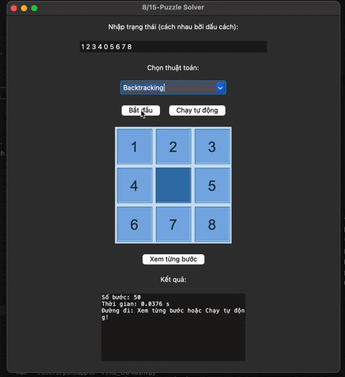

- **Backtracking FC (Forward Checking)**: Kết hợp kiểm tra trước để loại bỏ giá trị không hợp lệ, tăng hiệu quả so với backtracking cơ bản.
  
  **Đánh giá:**
  - **Ưu điểm:** Hiệu quả hơn backtracking cơ bản.
  - **Nhược điểm:** Vẫn không tối ưu cho 8-puzzle.
  - **Phù hợp:** Bài toán ràng buộc.

  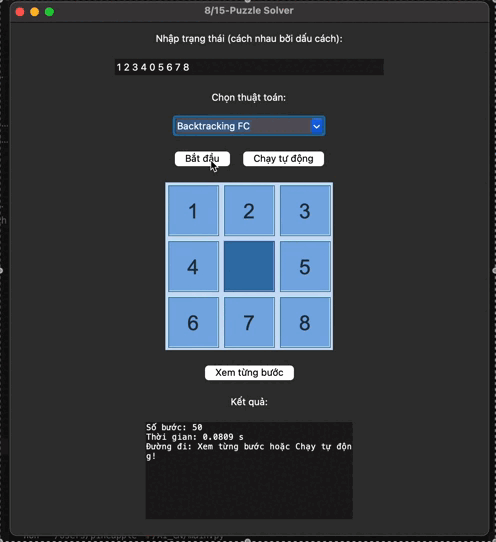

- **Min-Conflicts**: Bắt đầu từ trạng thái ngẫu nhiên và liên tục sửa các biến gây xung đột, phù hợp cho bài toán lớn.
  
  **Đánh giá:**
  - **Ưu điểm:** Tốt cho bài toán CSP lớn.
  - **Nhược điểm:** Không phù hợp cho 8-puzzle.
  - **Phù hợp:** CSP lớn.

  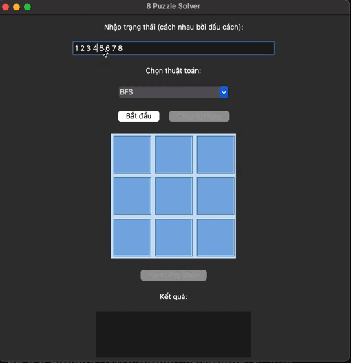

## 6. Học tăng cường (Reinforcement Learning)
- **Q-Learning**: Học giá trị hành động tối ưu thông qua trải nghiệm, không cần mô hình môi trường.
  
  **Đánh giá:**
  - **Ưu điểm:** Có thể học giải pháp tối ưu qua nhiều lần thử.
  - **Nhược điểm:** Cần nhiều thời gian huấn luyện, không hiệu quả ngay với 8-puzzle nhỏ.
  - **Phù hợp:** Khi muốn thử nghiệm học máy.

  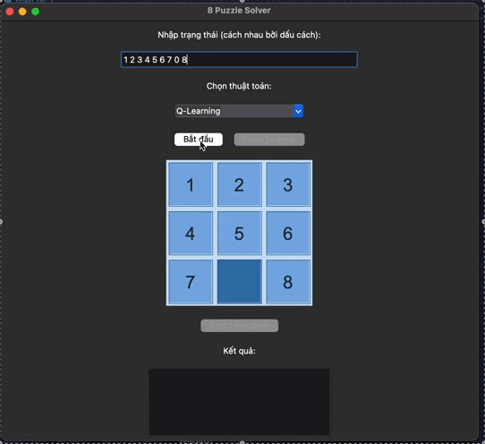

- **DQN (Deep Q-Network)**: Mở rộng Q-Learning với mạng nơ-ron sâu để xấp xỉ hàm Q, giải quyết không gian trạng thái lớn.
  
  **Đánh giá:**
  - **Ưu điểm:** Áp dụng cho không gian trạng thái lớn.
  - **Nhược điểm:** Quá phức tạp cho 8-puzzle, cần nhiều tài nguyên.
  - **Phù hợp:** Nghiên cứu học sâu.

  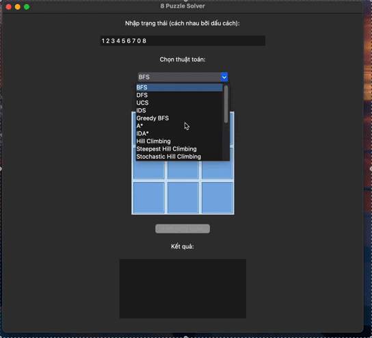

- **SARSA**: Tương tự Q-Learning nhưng cập nhật giá trị dựa trên hành động thực tế đã chọn, phù hợp cho các bài toán cần chính sách an toàn.
  
  **Đánh giá:**
  - **Ưu điểm:** Chính sách an toàn hơn Q-Learning.
  - **Nhược điểm:** Cần nhiều thời gian huấn luyện.
  - **Phù hợp:** Nghiên cứu học máy.

  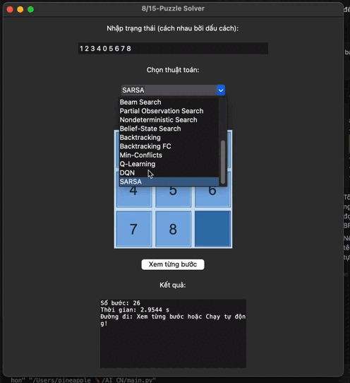

#

## 📊 BẢNG SO SÁNH THUẬT TOÁN GIẢI 8-PUZZLE

| STT | Thuật toán                  | Loại tìm kiếm             | Ưu điểm | Nhược điểm | Phù hợp | Tối ưu | Tốc độ | Mô phỏng |
|-----|-----------------------------|--------------------------|---------|------------|---------|--------|--------|----------|
| 1   | BFS                         | Không thông tin          | Tối ưu, dễ hiểu | Rất tốn bộ nhớ | Bài toán nhỏ | ✅ | ⚡ Trung bình | [▶](video/BFS.mov) |
| 2   | DFS                         | Không thông tin          | Tiết kiệm bộ nhớ | Dễ bị lặp, không tối ưu | Không khuyến khích | ❌ | ⚡⚡ Nhanh (hên xui) | [▶](video/DFS.mov) |
| 3   | UCS                         | Không thông tin          | Tối ưu nếu chi phí dương | Tốn bộ nhớ | Chi phí khác nhau | ✅ | ⚡ Trung bình | [▶](video/UCS.mov) |
| 4   | IDS                         | Không thông tin          | Tối ưu, ít bộ nhớ hơn BFS | Lặp lại nhiều lần | Bộ nhớ hạn chế | ✅ | 🐢 Chậm | [▶](video/IDS.mov) |
| 5   | Greedy BFS                  | Có thông tin             | Rất nhanh | Không tối ưu | Cần lời giải nhanh | ❌ | ⚡⚡⚡ Rất nhanh | [▶](video/GreedyBFS.mov) |
| 6   | A*                          | Có thông tin             | Tối ưu, nhanh | Tốn bộ nhớ | Bài toán tiêu chuẩn | ✅ | ⚡⚡ Nhanh | [▶](video/Astar.mov) |
| 7   | IDA*                        | Có thông tin             | Tối ưu, ít bộ nhớ | Chạy lâu | Bộ nhớ hạn chế | ✅ | 🐢 Trung bình | [▶](video/IDAstar.mov) |
| 8   | Hill Climbing               | Cục bộ                   | Đơn giản | Kẹt tại cực trị | Không khuyến khích | ❌ | ⚡⚡ Nhanh | [▶](video/HillClimbing.mov) |
| 9   | Steepest Hill Climbing      | Cục bộ                   | Tốt hơn Hill Climbing | Vẫn bị kẹt | Cần tốc độ | ❌ | ⚡⚡ Nhanh | [▶](video/SteepestHillClimbing.mov) |
| 10  | Stochastic Hill Climbing    | Cục bộ                   | Giảm lặp | Không chắc chắn | Heuristic thử nghiệm | ❌ | ⚡⚡ Nhanh | [▶](video/StochasticHillClimbing.mov) |
| 11  | Simulated Annealing         | Cục bộ                   | Thoát cực trị | Chạy không ổn định | Tránh bị kẹt | ❌ | ⚡⚡ TB | [▶](video/SimulatedAnnealing.mov) |
| 12  | Genetic Algorithm           | Cục bộ (Heuristic)       | Đa dạng lời giải | Cần tham số tốt | Tùy biến cao | ❌ | ⚡ TB | [▶](video/GeneticAlgorithm.mov) |
| 13  | Beam Search                 | Cục bộ                   | Nhanh, ít bộ nhớ | Không tối ưu | Cần tốc độ | ❌ | ⚡⚡⚡ Rất nhanh | [▶](video/BeamSearch.mov) |
| 14  | Partial Obs. Search         | Môi trường phức tạp      | Mô phỏng thực tế | Khó áp dụng | Bài toán nâng cao | ❌ | 🐢 Chậm | [▶](video/PartialObservationSearch.mov) |
| 15  | Nondeterministic Search     | Môi trường phức tạp      | Phù hợp bất định | Rất phức tạp | Không phù hợp | ❌ | 🐢 Chậm | [▶](video/NondeterministicSearch.mov) |
| 16  | Belief-State Search         | Môi trường phức tạp      | Xử lý bất định | Không cần thiết | Nghiên cứu nâng cao | ❌ | 🐢 Chậm | [▶](video/BeliefStateSearch.mov) |
| 17  | Backtracking                | CSP/Quay lui             | Tìm mọi lời giải | Không tối ưu thời gian | Kiểm tra ràng buộc | ❌ | 🐢 Chậm | [▶](video/Backtracking.mov) |
| 18  | Backtracking FC             | CSP                      | Hiệu quả hơn Backtracking | Không tối ưu cho 8-puzzle | CSP | ❌ | 🐢 Chậm | [▶](video/BacktrackingFC.mov) |
| 19  | Min-Conflicts               | CSP                      | Rất nhanh | Áp dụng hạn chế | CSP đơn giản | ❌ | ⚡⚡ Nhanh | [▶](video/MinConflicts.mov) |
| 20  | Q-Learning                  | Reinforcement Learning   | Học từ kinh nghiệm | Cần huấn luyện | RL cơ bản | ❌ | 🐢 Chậm ban đầu | [▶](video/QLearning.mov) |
| 21  | SARSA                       | Reinforcement Learning   | Tối ưu chính sách | Khó cài đặt | Bài toán động | ❌ | 🐢 Chậm ban đầu | [▶](video/SARSA.mov) |
| 22  | DQN                         | Deep RL                  | Mạng nơ-ron mạnh | Cần GPU, dữ liệu | Bài toán lớn | ❌ | 🐢 Rất chậm ban đầu | [▶](video/DQN.mov) |

## Cài đặt

1. **Clone dự án:**
   ```bash
   git clone <link-repo>
   cd AI_CN
   ```

2. **Tạo môi trường ảo (khuyến nghị):**
   ```bash
   python3 -m venv .venv
   source .venv/bin/activate
   ```

3. **Cài đặt các thư viện phụ thuộc:**
   ```bash
   pip install -r requirements.txt
   ```

## Chạy chương trình

```bash
python main.py
```

Giao diện sẽ xuất hiện, bạn nhập trạng thái puzzle (các số cách nhau bởi dấu cách, ví dụ: `1 2 3 4 0 5 6 7 8`), chọn thuật toán và nhấn "Bắt đầu".

## Cấu trúc dự án

- `main.py`: Điểm khởi động ứng dụng.
- `src/window/`: Giao diện người dùng (Tkinter).
- `src/utils/`: Định nghĩa trạng thái và các tiện ích cho puzzle.
- `src/algorithms/`: Chứa các thuật toán giải (tìm kiếm, local search, CSP, reinforcement learning,...).

## Yêu cầu

- Python >= 3.8
- Các thư viện: numpy, matplotlib, pandas, scikit-learn, gymnasium

## Đóng góp

Mọi đóng góp, ý kiến hoặc báo lỗi xin gửi issue hoặc pull request.
